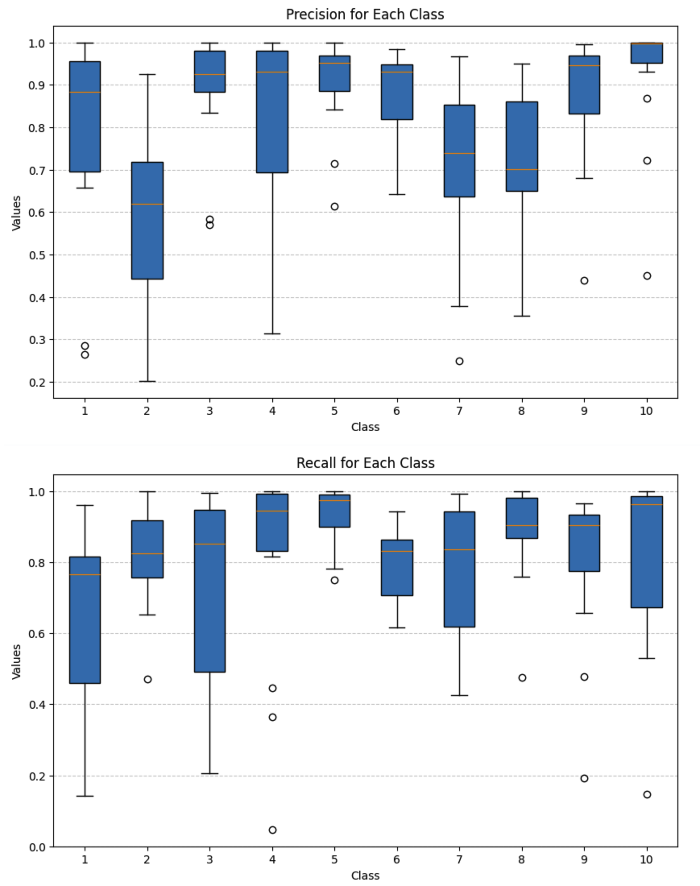
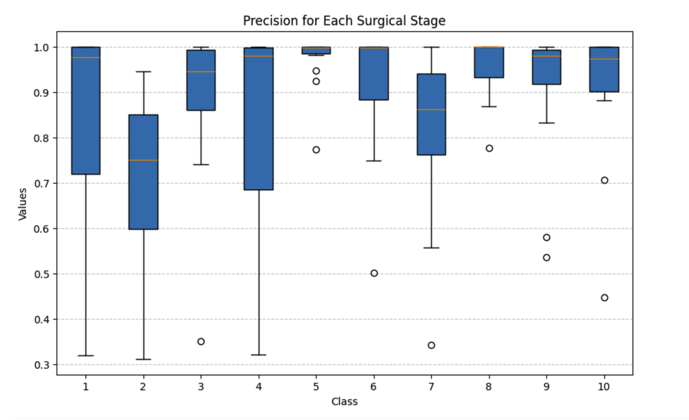
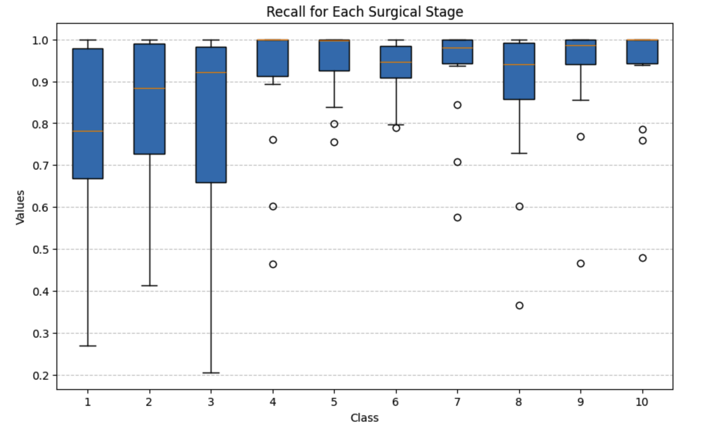

# Performance Evalutation based on Cataract101 Dataset

## RestNet50 as sole phase recognizer 
### Video-level Performance Metrics
- **Average Accuracy:** ~81.42% ± 7.42  
- **Average F1-Score:** ~76.64% ± 8.19  
### Stage-level Performance Metrics
- **Average Stage-level Precision:** ~80.97% ± 19.87  
- **Average Stage-level Recall:** ~79.56% ± 21.81  

## ResNet50 + TCN
### Video-level Performance Metrics
- **Average Accuracy:** ~88.41% ± 6.24  
- **Average F1-Score:** ~85.89% ± 6.16  
### Stage-level Performance Metrics
- **Average Stage-level Precision:** ~87.37% ± 18.15  
- **Average Stage-level Recall:** ~88.32% ± 17.74  

