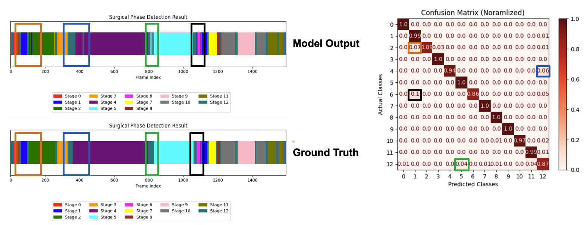

# Performance Evalutation based on Cataract1k Dataset

## RestNet50 as sole phase recognizer 
### Video-level Performance Metrics
- **Average Accuracy:** ~89.03% ± 4.32  
- **Average F1-Score:** ~85.14% ± 4.01  
### Stage-level Performance Metrics
- **Average Stage-level Precision:** ~87.70% ± 15.8  
- **Average Stage-level Recall:** ~86.36% ± 16.5  

## ResNet50 + TCN
### Video-level Performance Metrics
- **Average Accuracy:** ~92.80% ± 3.38  
- **Average F1-Score:** ~90.60% ± 4.42  
### Stage-level Performance Metrics
- **Average Stage-level Precision:** ~90.81% ± 13.33  
- **Average Stage-level Recall:** ~93.09% ± 12.01  

### Qualitative Analysis
